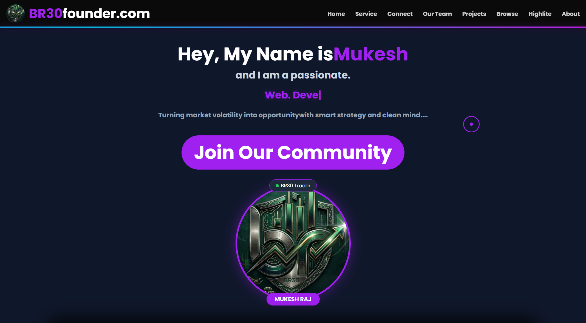
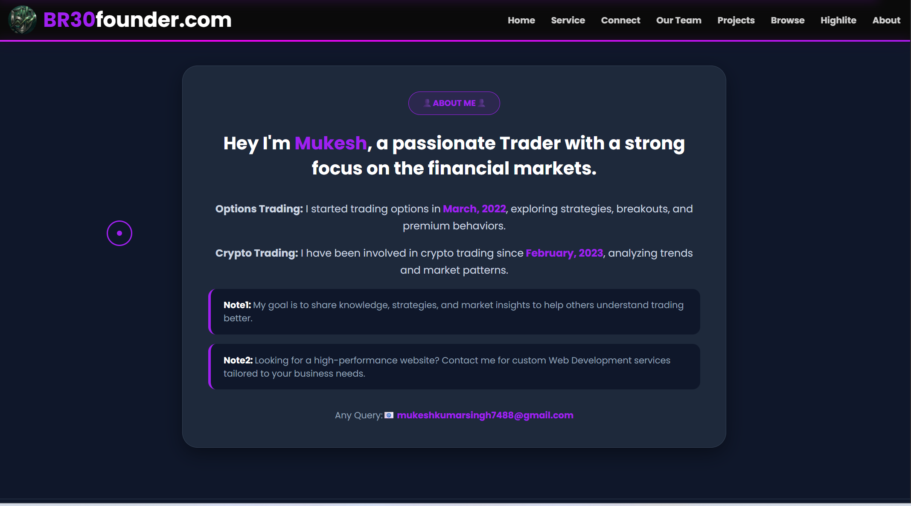
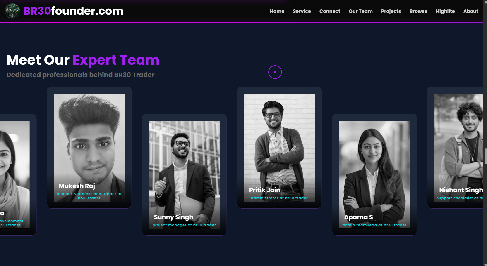
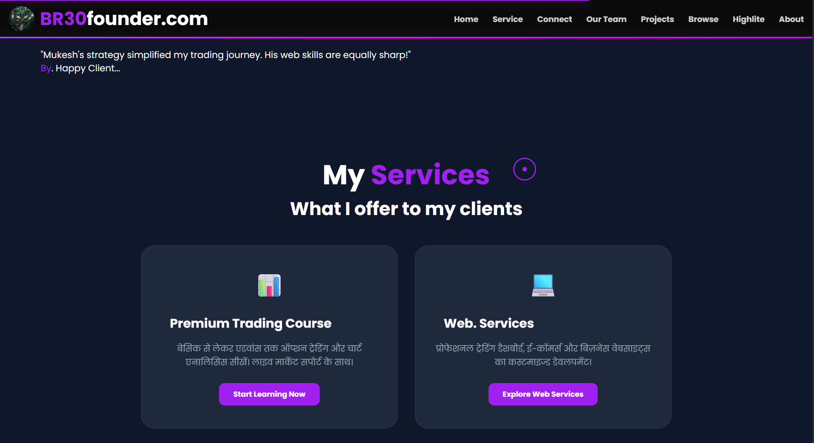
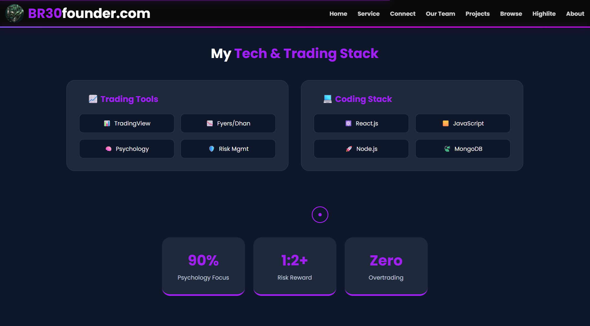
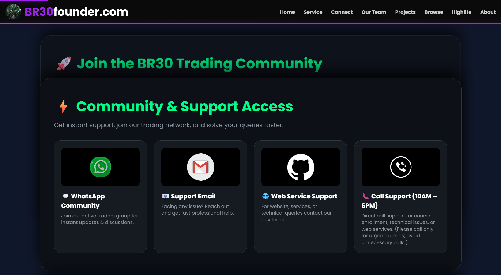
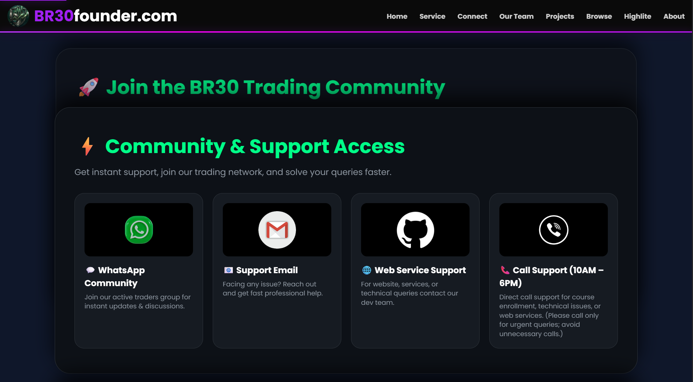
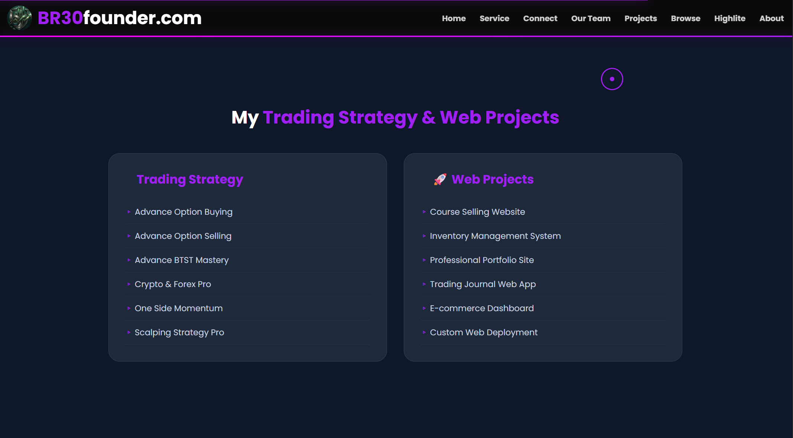
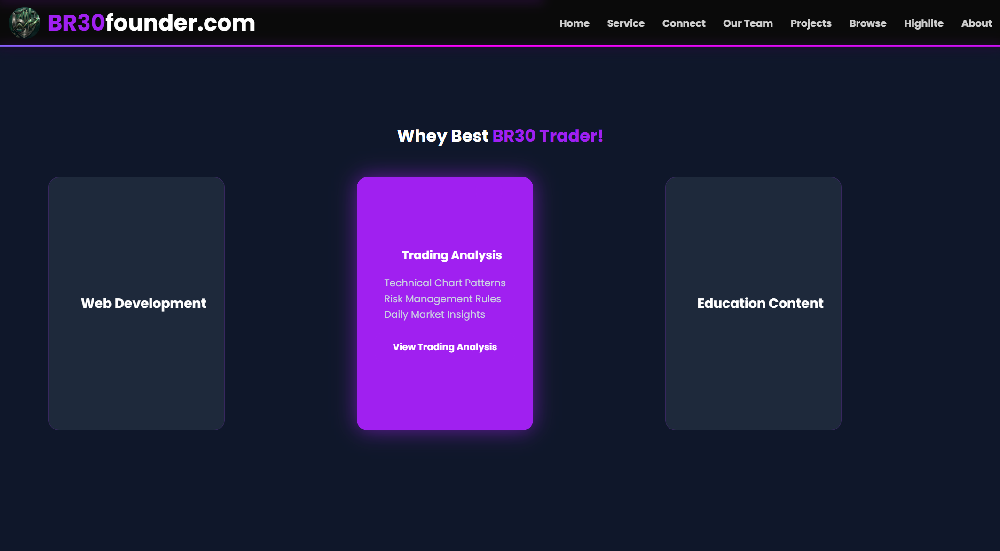
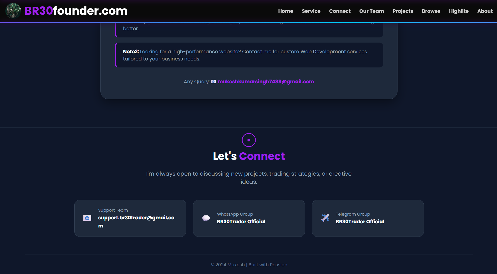

# BR30 Founder

🚀 **BR30 Founder** is a personal portfolio website of **Mukesh Raj**, built to showcase skills, services, projects, founder journey and digital work under the BR30 ecosystem.

This portfolio is designed for personal branding, web development services, logo design services, branding solutions and professional online presence.

---

## 🌐 Live Website

[🚀 Visit BR30 Founder](https://br30-com.vercel.app/)

---

## 🌟 Features

- Personal Portfolio Website
- Founder Profile Section
- Skills Showcase
- Web Development Services
- Logo Design Services
- Branding Services
- Project Showcase
- Contact Section
- Responsive Design
- SEO Optimized Pages
- Clean React Conversion
- Modern UI Sections
- Social Media Integration

---

## 🛠️ Tech Stack

### Frontend


---

### Deployment


---

### Development Tools


---

## 📁 Project Structure

```bash
BR30FOUNDER.COM.F
│
├── Burner/
│
├── dist/
│   └── assets/
│
├── images/
│
├── public/
│   ├── js/
│   │   └── script.js
│   ├── robots.txt
│   └── sitemap.xml
│
├── screenshots/
│
├── src/
│   │
│   ├── components/
│   │   ├── ScrollToTop.jsx
│   │   └── SiteLayout.jsx
│   │
│   ├── pages/
│   │   ├── BosChoch.jsx
│   │   ├── BrokerSetup.jsx
│   │   ├── ChartingTools.jsx
│   │   ├── Customlogo.jsx
│   │   ├── EntryConfirmation.jsx
│   │   ├── FairValueGaps.jsx
│   │   ├── FomoControll.jsx
│   │   ├── Home.jsx
│   │   ├── IndicatorSetup.jsx
│   │   ├── KillZones.jsx
│   │   ├── Learn.jsx
│   │   ├── LiquidityGrabs.jsx
│   │   ├── LossRecovery.jsx
│   │   ├── Masterclass.jsx
│   │   ├── MultiTimeframe.jsx
│   │   ├── NewsTerminals.jsx
│   │   ├── OrderBlocks.jsx
│   │   ├── PatiencePower.jsx
│   │   ├── PoiAnalysis.jsx
│   │   ├── PositionSizing.jsx
│   │   ├── RiskRewardRatio.jsx
│   │   ├── StopLossDiscipline.jsx
│   │   ├── TradeJournaling.jsx
│   │   ├── TradingAnalysis.jsx
│   │   ├── TradingDiscipline.jsx
│   │   └── WebService.jsx
│   │
│   ├── App.jsx
│   └── main.jsx
│
├── .env
├── .gitignore
├── .prettierrc
├── index.html
├── package-lock.json
├── package.json
├── README.md
├── vercel.json
└── vite.config.js
```

---

## 📸 Screenshots

### 🏠 Home Page



---

### 👤 About Section



---

### 👥 Expert Team Section



---

### 💼 Services Section



---

### 🛠️ Tech Stack Section



---

### 🧩 Stack Card Section



---

### 🧩 Stack Card 2



---

### 📂 Strategy & Project Section



---

### 🌐 Network & Connect Section


---

### ⭐ Why Best Section



---

### 📬 Footer Connect Section



## 🚀 BR30 Ecosystem

This portfolio is part of the BR30 ecosystem:

| Project                | Live Demo                                                           |
| ---------------------- | ------------------------------------------------------------------- |
| 🌐 BR30 Group          | [Visit Website](https://br-30-group-com.vercel.app/)                |
| 🚀 BR30 Trader         | [Visit Website](https://my-frontend-eight-roan.vercel.app/)         |
| 🛒 BR30 Kart           | [Visit Website](https://br-30-kart.vercel.app/)                     |
| 📈 BR30 Algo           | [Visit Website](https://br30algo-com.vercel.app/)                   |
| 📊 BR30 Market Scanner | [Visit Website](https://br30marketscanner-com-frontade.vercel.app/) |
| 👨‍💻 BR30 Founder        | [Visit Website](https://br30-com.vercel.app/)                       |

---

---

## 👨‍💻 Developed By

**Mukesh Raj**  
Founder — **BR30 Group**

---

## 📬 Connect With Me

[](https://www.linkedin.com/in/mukeshraj-br30/)

[](https://github.com/mukeshkumarsingh7488-afk)

[](https://www.instagram.com/br30Traderofficial)

[](https://www.youtube.com/@br30traderofficial)

[](https://t.me/+hBAT4kWo63A4ZWY1)

---

---

## 🚀 Project Status

BR30 Founder is actively maintained and improved as a personal portfolio, service showcase and founder branding website.

---

### Build • Create • Brand • Grow 🚀
